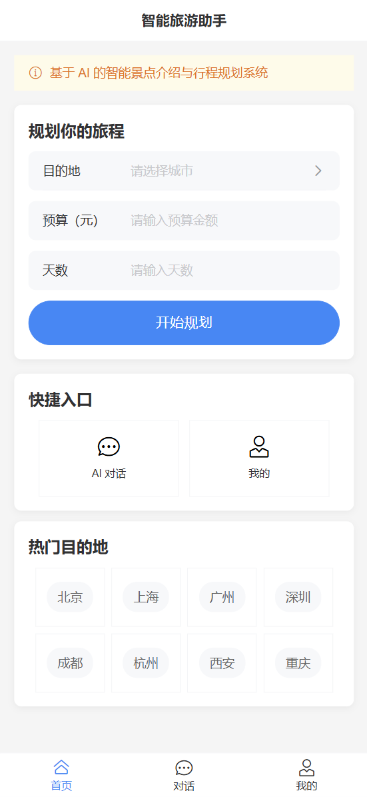
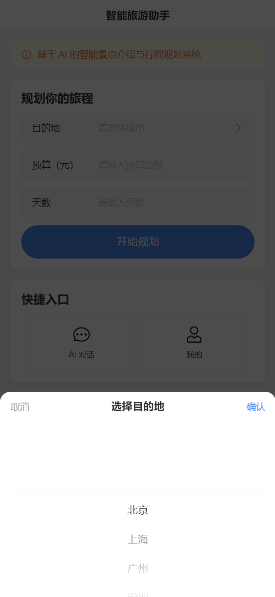
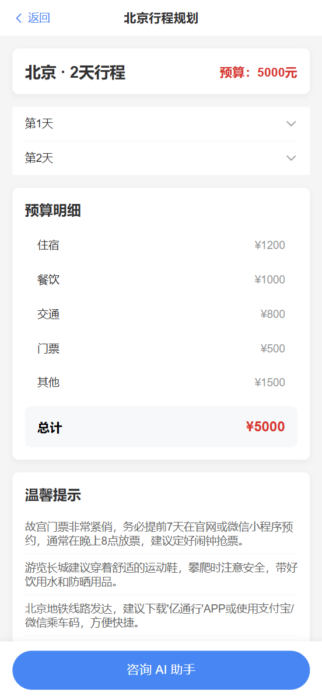

# 🧳 智能旅游助手 (AI Travel Planner)

基于 AI 技术的全栈旅游规划平台 — 个性化行程推荐 + 实时流式对话 + RAG 知识增强。


---

## 📸 预览

| 首页 | 行程规划 | AI 对话 |
|------|---------|--------|
|  |  |  |

---

## 🏗 架构

```
Vue 3 + Vant UI (:5174)
       │ HTTP REST + SSE
       ▼
Java Spring Boot 3.2 (:8080)
  Controller → Service → AgentGateway
       │ OkHttp
       ▼
Python FastAPI Agent (:5000)
  BaseAgent (Tool Calling Loop)
  + RAG (ChromaDB) + Memory (Session)
       │ OpenAI-compatible API
       ▼
DeepSeek / SiliconFlow LLM
```

> **Java 是骨架/网关** — REST API、参数校验、SSE 透传，不直接调用大模型。
> **Python Agent 是大脑** — AI 推理、Tool Calling、RAG 检索、会话记忆。

---

## ✨ 功能

- 🤖 **AI 智能规划** — 输入目的地/预算/天数，Agent 调用工具查询景点、门票、预算，生成完整行程
- 💬 **流式对话** — SSE 实时打字机效果，多轮对话带记忆
- 📚 **RAG 知识库** — ChromaDB + sentence-transformers 本地向量检索
- 🔍 **城市联想搜索** — 支持 120+ 城市自由输入 + 联想提示
- 🎨 **Markdown 渲染** — AI 回复支持表格、代码块、列表等格式
- 📊 **流式进度反馈** — 规划过程实时显示进度（检索→查景点→算预算→生成）
- 📱 **响应式设计** — 移动端优先，桌面端居中适配

---

## 🚀 快速开始

### 环境要求

| 依赖 | 版本 |
|------|------|
| Node.js | ≥18 |
| Java | ≥17 |
| Python | ≥3.10 |
| Maven | 3.8+ (或使用 `mvnw`) |

### 1. 克隆仓库

```bash
git clone https://github.com/liujinkun1745/travel-agent.git
cd travel-agent
```

### 2. 启动 Python Agent（必须先启动）

```bash
cd travel-agent-py
pip install -r requirements.txt

# 设置 LLM API Key（二选一）
export DEEPSEEK_API_KEY="sk-xxxxxxxx"
# export SILICONFLOW_API_KEY="sk-xxxxxxxx"

python server.py
# → 启动在 http://localhost:5000
```

### 3. 启动 Java 后端

```bash
cd travel-server-java

# 同样需要设置 API Key 环境变量
export DEEPSEEK_API_KEY="sk-xxxxxxxx"

./mvnw spring-boot:run
# → 启动在 http://localhost:8080
```

### 4. 启动 Vue 前端

```bash
cd travel-h5
npm install
npm run dev
# → 启动在 http://localhost:5174
```

### 5. 访问

浏览器打开 **http://localhost:5174**

---

## 📁 项目结构

```
travel-agent/
├── travel-h5/              # Vue 3 前端 (Vant UI + Pinia + Vite)
│   └── src/
│       ├── views/          # 页面：首页/详情/对话/我的
│       ├── components/     # 组件：气泡/时段/预算表
│       ├── stores/         # Pinia 状态管理
│       ├── router/         # Hash 路由
│       └── utils/          # Axios 封装
├── travel-server-java/     # Java Spring Boot 网关
│   └── src/main/java/com/travel/server/
│       ├── controller/     # REST + SSE 端点
│       ├── service/        # 业务逻辑
│       ├── gateway/        # Python Agent HTTP 调用
│       ├── dto/            # 请求 DTO
│       └── vo/             # 响应 VO
├── travel-agent-py/        # Python AI Agent
│   ├── agents/             # TravelAgent + ChatAgent
│   ├── tools/              # 工具集 (5 个 Tool)
│   ├── memory/             # 多租户会话记忆
│   ├── rag/                # ChromaDB 向量知识库
│   └── server.py           # FastAPI 入口
└── 展示效果/               # 截图预览
```

---

## 🔑 环境变量

| 变量 | 说明 | 必需 |
|------|------|------|
| `DEEPSEEK_API_KEY` | DeepSeek API 密钥 | 二选一 |
| `SILICONFLOW_API_KEY` | SiliconFlow API 密钥 | 二选一 |

---

## 📡 API 接口

| 方法 | 路径 | 说明 |
|------|------|------|
| POST | `/api/travel/recommend` | 非流式旅游规划 |
| POST | `/api/travel/recommend/stream` | **流式**规划（SSE 进度推送） |
| POST | `/api/travel/chat` | SSE 流式对话 |
| GET | `/health` | Python Agent 健康检查 + RAG 统计 |
| GET | `/agent/history/{id}` | 会话历史 |
| GET | `/agent/stats` | 全局统计 |

---

## 🧠 Agent Tool Calling 流程

```
用户: "北京3天3000元"
  → RAG 检索 "北京 旅游 景点"
  → LLM 带工具调用
    → search_spot("故宫", "北京") → 获取详情
    → check_ticket("故宫") → 确认门票
    → calc_budget(3000, 3, "北京") → 预算分配
    → travel_plan_done → 强制输出 JSON
  → 提取校验 JSON → 返回结构化行程
```

---

## 📝 待办

- [ ] 用户系统（JWT / Spring Security / 登录注册）
- [ ] Redis 缓存优化
- [ ] RAG 知识库扩展（美食/交通/贴士）
- [ ] Web 搜索工具接入真实 API

---

## 📄 License

MIT
